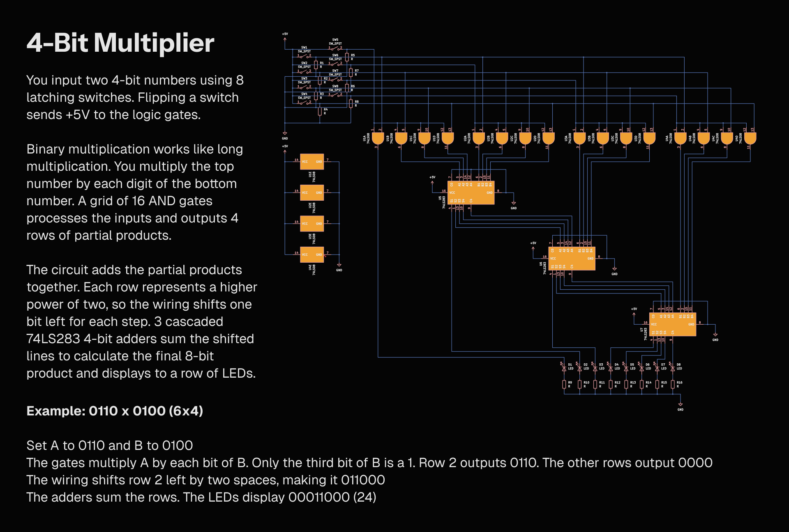

A combinatorial logic multiplier. You flip switches to input numbers, and a matrix of 16 AND gates turns them into partial products. Three cascaded 4-bit adders shift and sum the binary lines to calculate a product up to 225.
