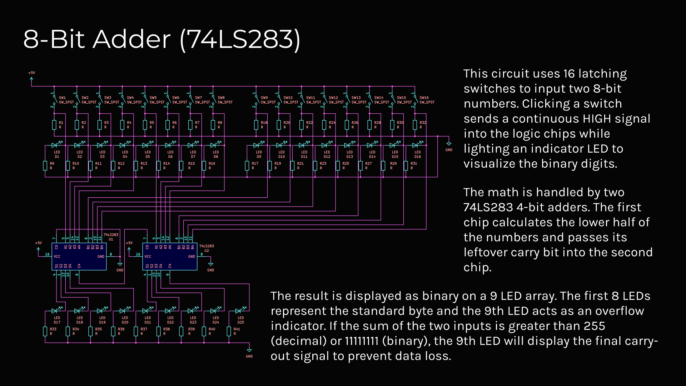

This project is a fully analog 8-bit hardware adder that uses 16 tactile latching switches and two cascaded 74LS283 logic chips to calculate binary sums in real-time without any code. Both the input variables and the final calculations are visualized using dedicated LEDs to show the exact data being processed purely through physical electrical paths. The final result is displayed as binary on a 9-LED output array, with the ninth LED acting as a overflow indicator to prevent data loss if the sum exceeds 255.
