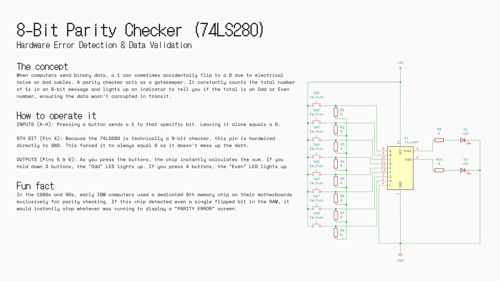

It's an 8-bit hardware parity checker built around the 74LS280 chip. I designed the schematic in KiCad to demonstrate digital error detection and data validation. It uses 8 main push buttons as inputs to simulate an 8-bit data payload, instantly counting the sum of the 1s, and then displays whether the total count is odd or even through two indicator LEDs.
