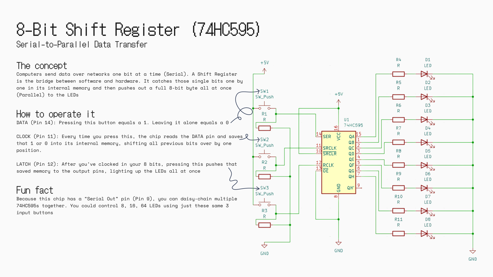

It's an 8-bit shift register built around the 74HC595 chip. I designed the schematic in KiCad to demonstrate serial-to-parallel data transfer. It uses three main push buttons (**Data**, **Clock**, and **Latch**) to push 1s and 0s into the chip's internal memory serially, and then displays them in parallel to a row of 8 LEDs.
