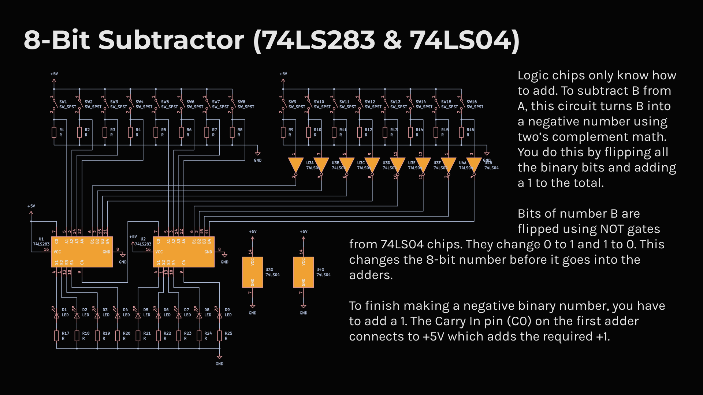

A hardware binary subtractor that runs entirely on logic chips. You use 16 physical switches to enter two 8-bit numbers. The board uses 74LS04 NOT gates to flip the bits of the second number. Two 74LS283 adders then calculate the difference using two's complement math by adding a hardwired +1. The final answer lights up on a row of 9 LEDs.
