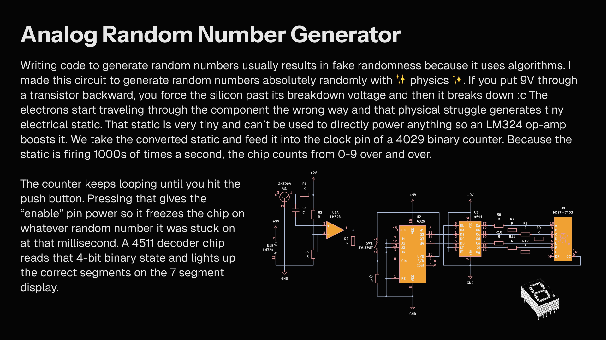

This is a completely code-free random number generator that relies on raw physics instead of software algorithms. It works by forcing a transistor into reverse breakdown to create physical electrical white noise, which is then used to drive a high-speed binary counter. Pressing a physical pushbutton freezes the counter at that exact millisecond, pushing a truly random 0-9 digit out to a 7-segment display.
