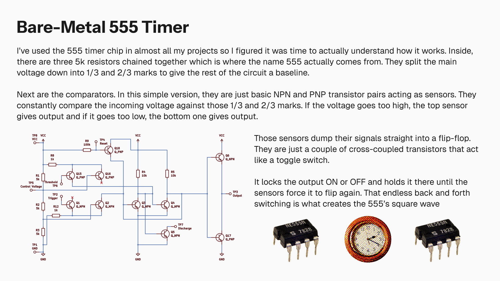

I've relied on the NE555 timer for basically everything I've built so far, like the coin flipper and the reaction timer. For this project, I decided I actually needed to know why it works. So, I built the inside of a 555 timer from scratch using just transistors and resistors. This is the logic of the chip showing exactly how the voltage dividers, sensors, and memory flip back and forth to create the square wave.
