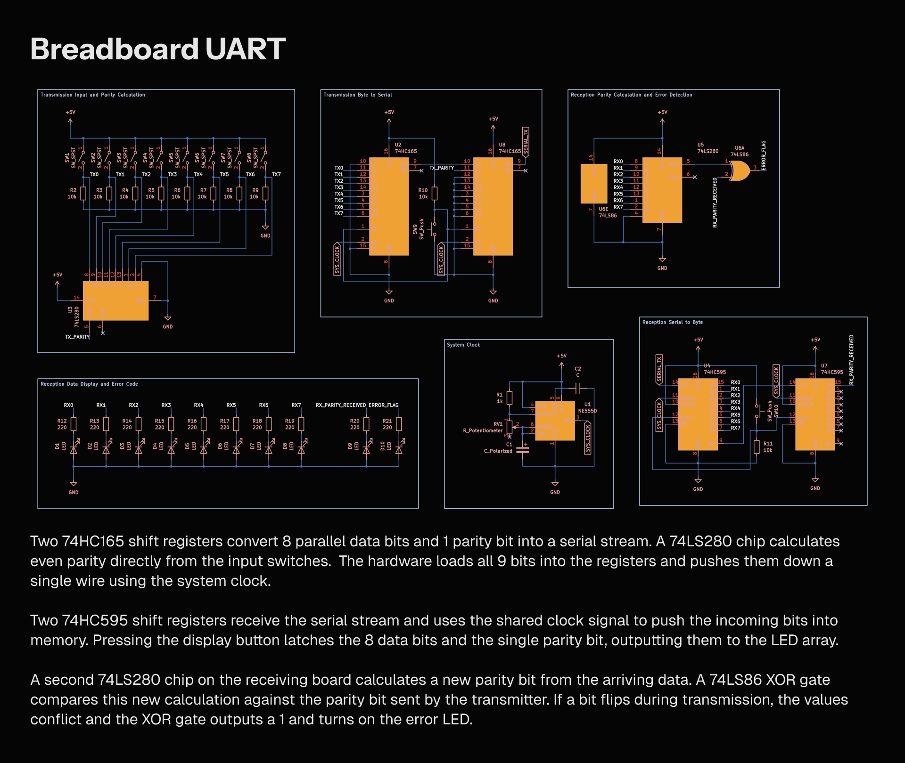

A hardware communication link that transfers 9 bits of data over a single wire. It uses 74HC165 shift registers to convert parallel input into a serial stream, and 74HC595 registers to catch it. 74LS280 parity generators and an XOR gate handle error detection by flagging flipped bits.
