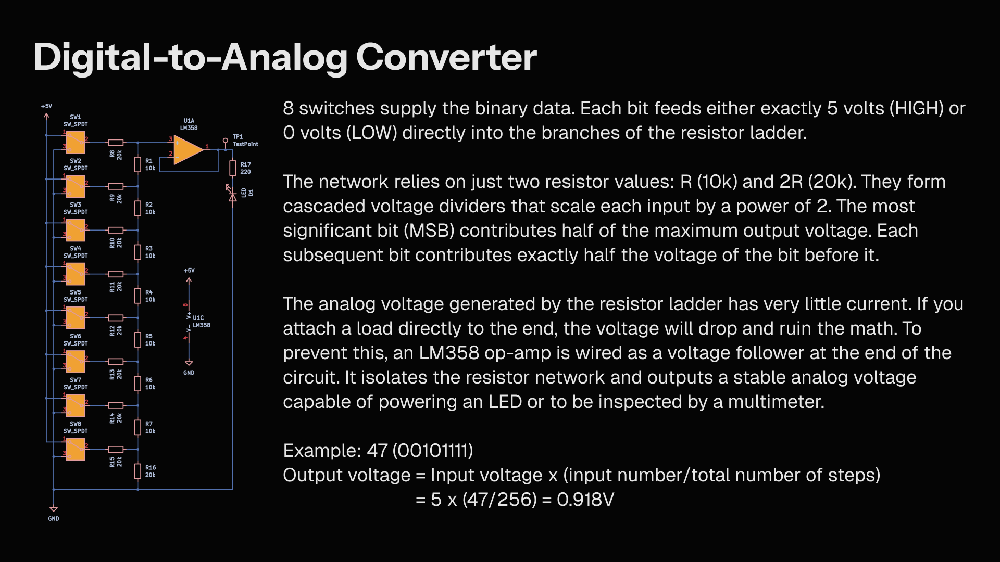

A hardware DAC built with an R-2R resistor ladder. 8 binary inputs feed into a network of 10kΩ and 20kΩ resistors. The circuit scales and sums these inputs to output 256 distinct analog voltage levels. An LM358 operational amplifier buffers the final signal.
