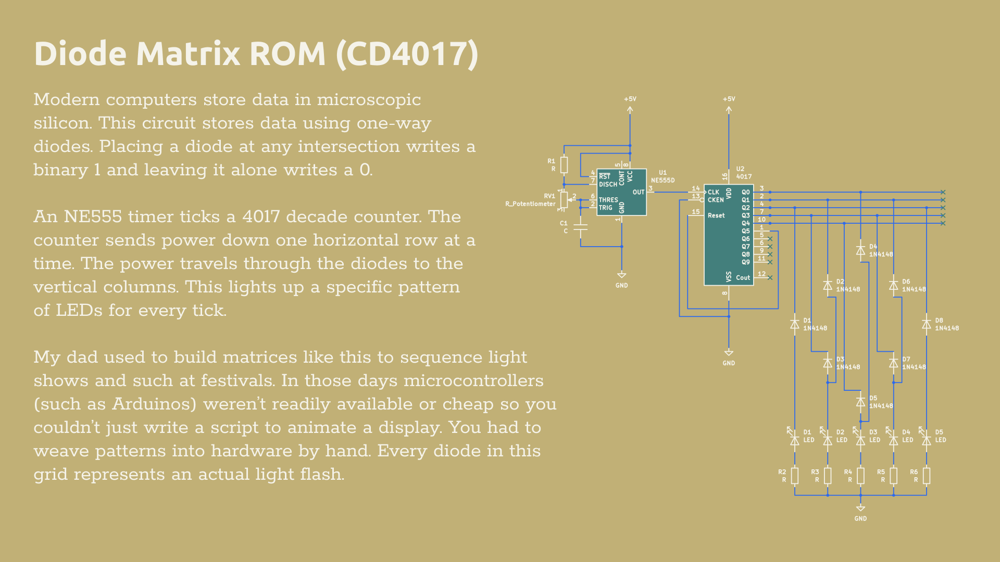

This circuit is a physical memory board. An NE555 timer and a CD4017 counter push power through a grid of intersecting wires one row at a time. You use standard 1N4148 diodes to connect specific rows to the LED columns. This creates a custom, looping light animation. Decades ago, people built matrices exactly like this to run massive festival light shows. Before microcontrollers were cheap, you had to physically plug components into a grid by hand to program the light patterns.
