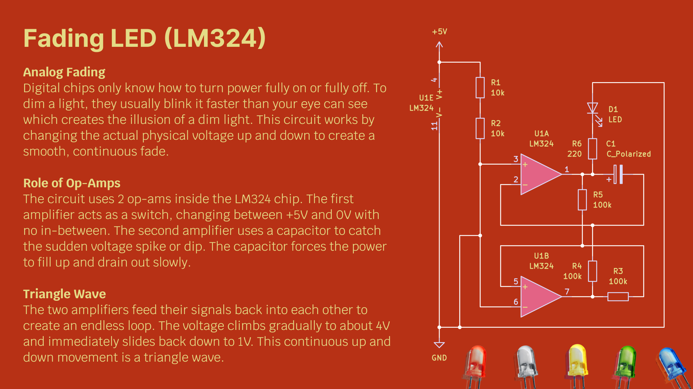

An analog lighting circuit that fades a single LED in and out. It uses two operational amplifiers inside an LM324 chip to generate a continuous triangle wave. The rising and falling voltage physically dims the light without using any digital code or PWM signals.
