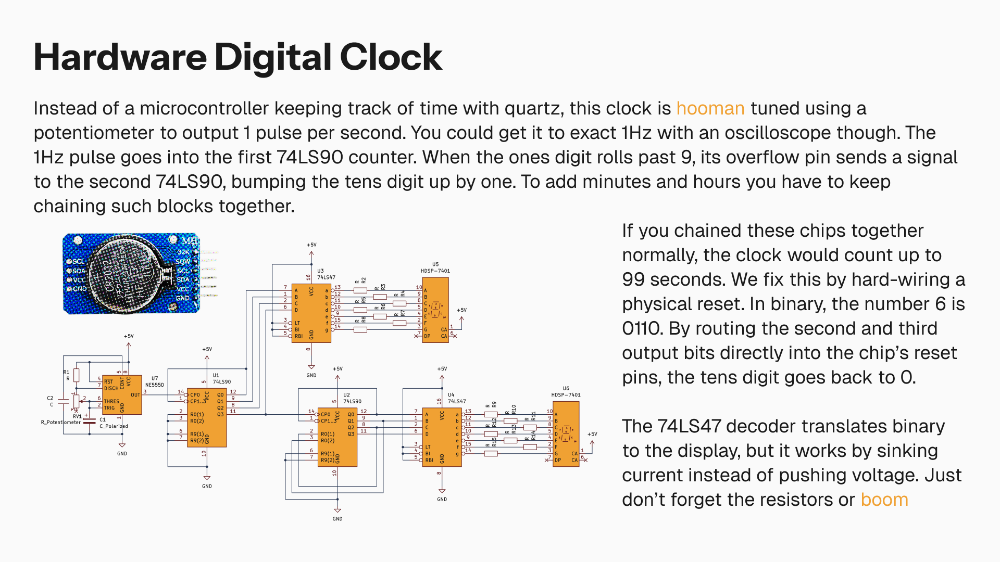

A digital clock built entirely with basic logic chips. It uses a 555 timer to create a steady 1Hz pulse, feeding that signal into a chain of 74LS90 counters and 74LS47 decoders. Instead of writing code to handle the 60-second rollover, the circuit just hardwires the tens counter to reset itself back to zero as soon as it hits six.
