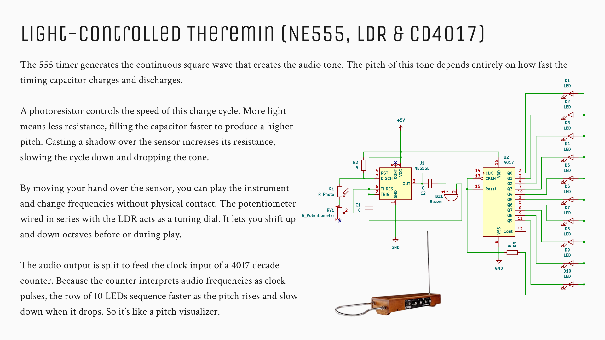

A fully analog instrument. It uses an NE555 timer wired as an audio oscillator, with a light-dependent resistor (LDR) and a tuning potentiometer controlling the timing loop. Moving your hand over the sensor physically bends the pitch of the square wave by blocking the ambient light. The output signal is then split to drive a CD4017 decade counter, creating a 10-LED sequence that speeds up and slows down in sync with the audio frequencies.
