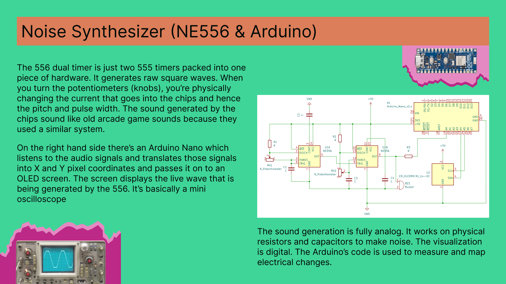

This circuit is a hybrid audio synthesizer and visualizer. It uses an analog 556 dual timer to generate raw, adjustable square waves for sound, while a digital Arduino Nano reads those audio spikes to draw a live waveform on an OLED screen.
