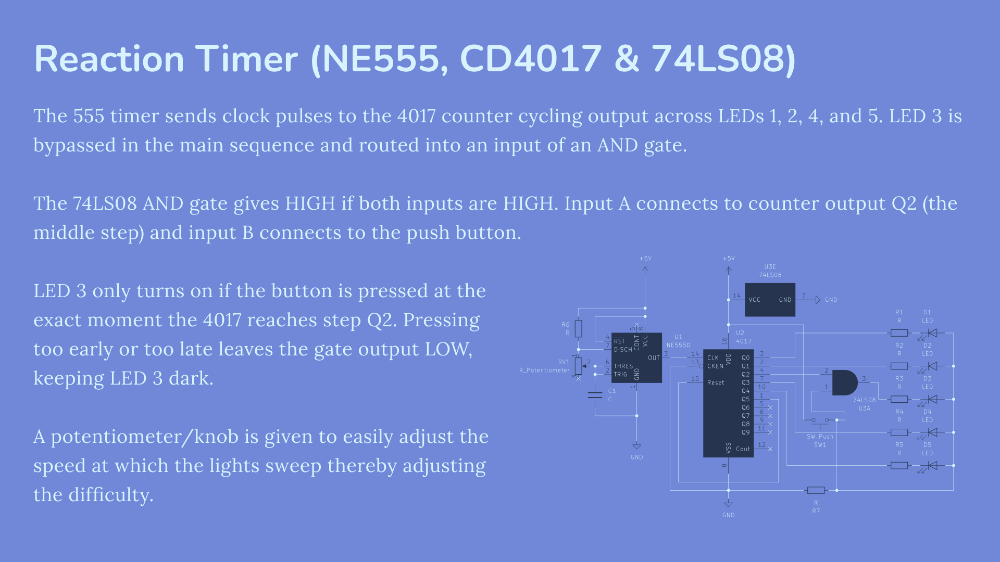

A 5-LED reaction game. A 555 timer and 4017 counter create a sweeping light sequence. The middle LED sits behind an AND gate. It remains dark unless you press a button at the exact millisecond the sequence crosses the center, completing the AND gate to win (light the LED up).
