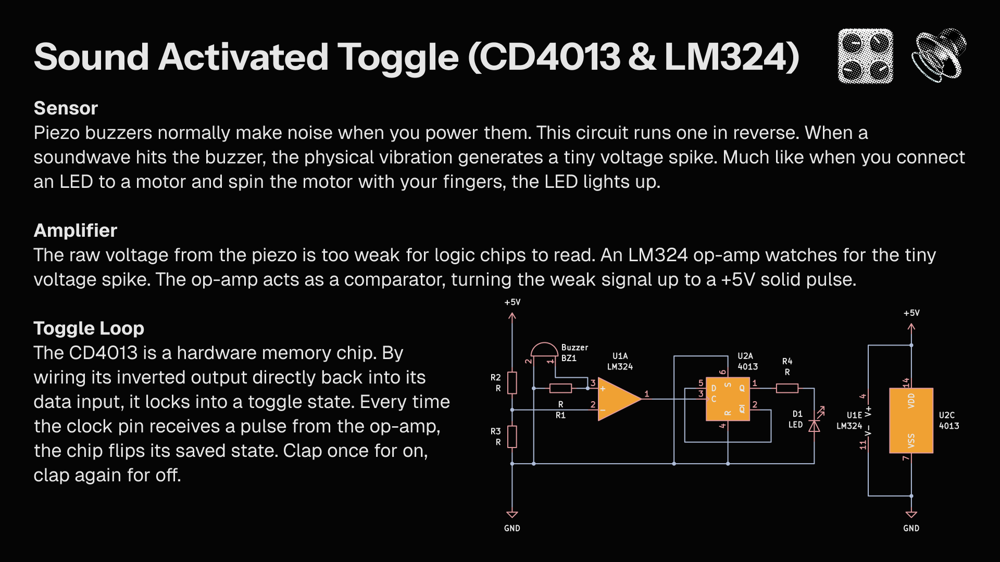

A hardware-based clapper circuit. A piezo buzzer acts as a microphone to detect sound spikes. An LM324 op-amp amplifies that physical vibration into a digital pulse, and a CD4013 flip-flop toggles an LED on and off with each loud noise.
