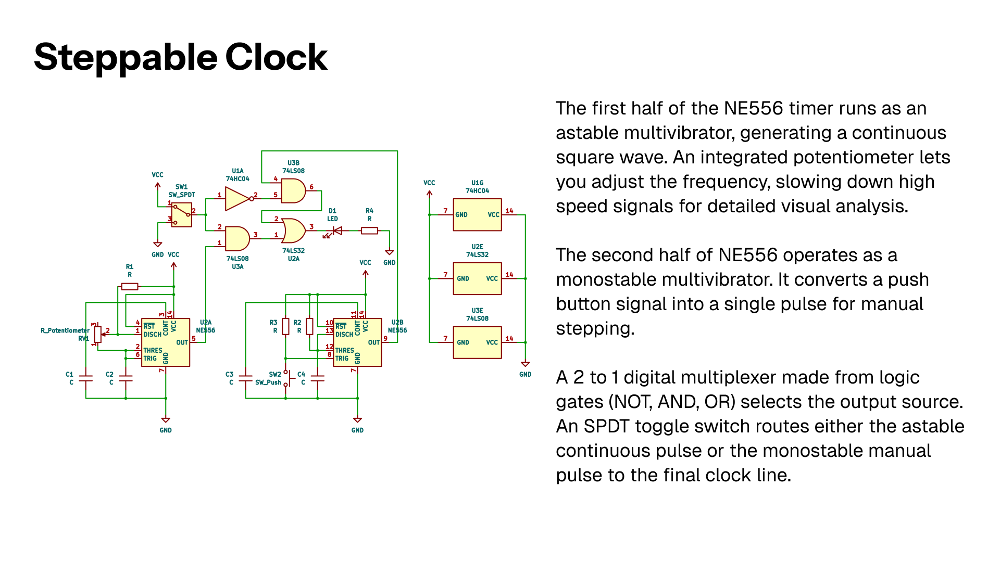

A dual-mode clock to drive digital logic circuits. Built around an NE556, it generates either an adjustable continuous wave or a manual pulse. A logic multiplexer handles the switching, letting you freeze time and manually step through binary math one pulse at a time.
