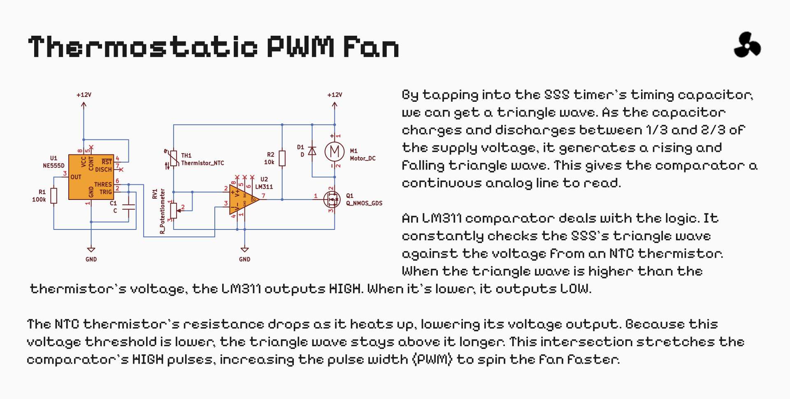

An analog temperature control system. A 555 timer charges and discharges a capacitor to generate a triangle wave. An LM311 comparator compares this wave against a reference voltage from an NTC thermistor. As the temperature rises, the threshold drops, which widens the PWM square wave and spins a 12V cooling fan faster.
