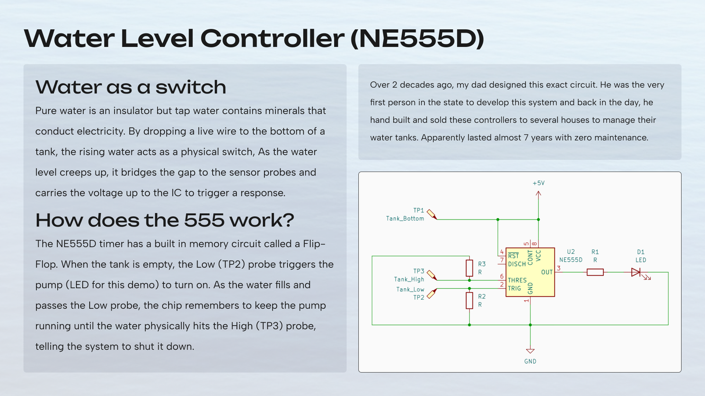

An automated water tank controller built around an NE555 timer and basic probe sensors. It uses the chip's internal memory loop to automatically manage a pump as water levels rise and fall. This is a recreation of a circuit my dad designed nearly twenty years ago.
